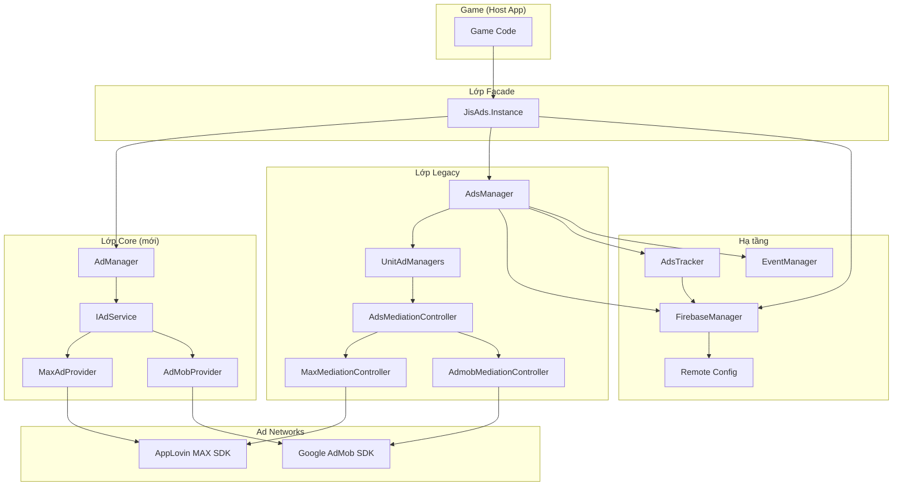
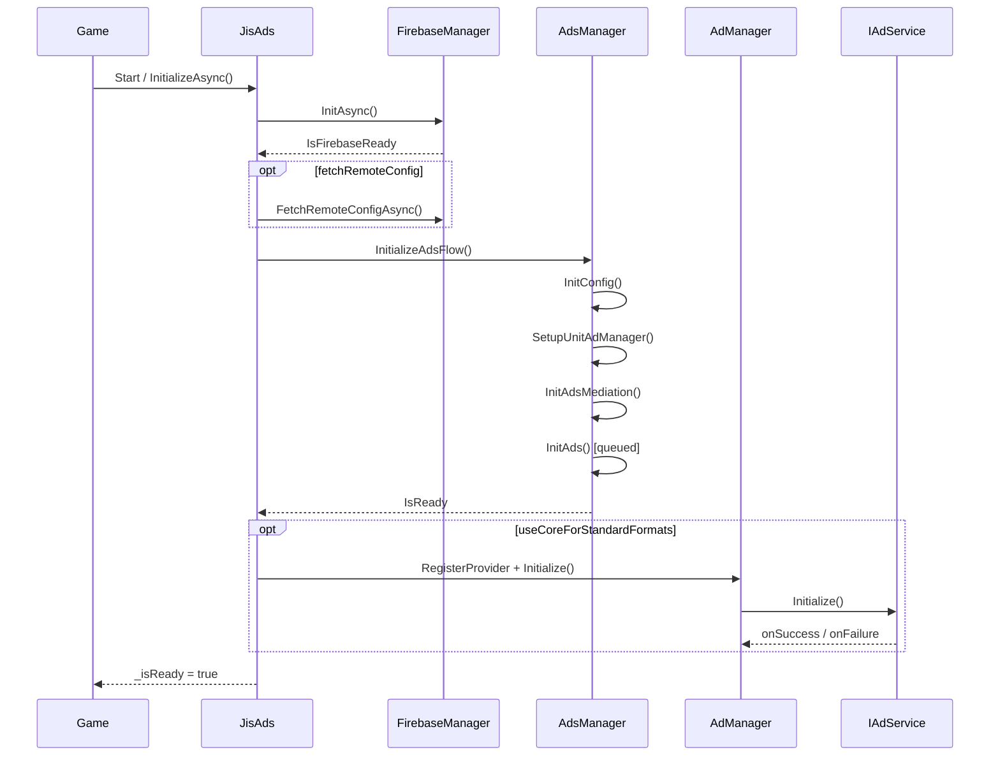
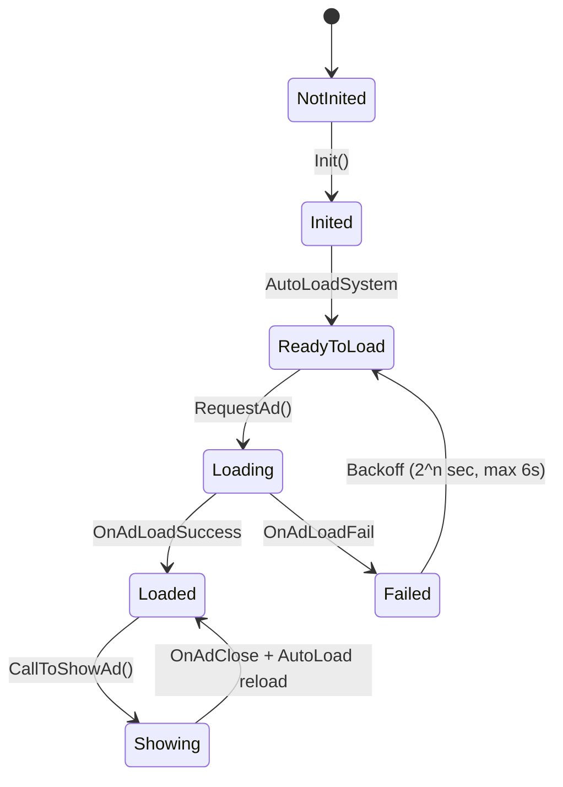
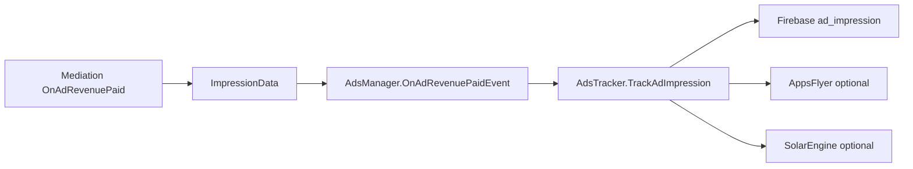

# Thiết kế hệ thống Ads — JIS SDK Ads v4

> Tài liệu mô tả kiến trúc và thiết kế hệ thống quảng cáo trong monorepo **SDK-Ads** (Unity UPM).  
> Cập nhật theo cấu trúc v4 — dual stack: **JisAds** (facade) + **Legacy AdsManager** + **Core AdManager**.  
> **Tiered Inventory (optional):** [TIERED_INVENTORY.md](TIERED_INVENTORY.md)

---

## 1. Tổng quan

### 1.1 Mục đích

**JIS SDK Ads v4** là bộ SDK Unity dùng cho game mobile (Android/iOS), cung cấp:

- Quản lý đa định dạng quảng cáo (Banner, Interstitial, Rewarded, App Open, MREC, …)
- Mediation qua **AppLovin MAX** hoặc **Google AdMob**
- Tích hợp **Firebase Analytics** và **Remote Config** để điều khiển hành vi ads từ xa
- Tracking doanh thu (impression revenue) và sự kiện ads
- Tùy chọn analytics bên thứ ba (AppsFlyer, SolarEngine, Facebook)

### 1.2 Phạm vi nền tảng

| Nền tảng | Hỗ trợ |
|----------|--------|
| Unity | 2022.3+ |
| Android | Đầy đủ |
| iOS | Đầy đủ |
| Editor | Placeholder / validation (một số format fail có chủ đích) |

### 1.3 Nguyên tắc thiết kế v4

1. **Một mediation chính trên mỗi platform** — ví dụ AdMob trên Android, MAX trên iOS (`JisSDKAdsSettings.singleMediationOnly`)
2. **Dual stack có chủ đích** — Core mới cho format chuẩn; Legacy giữ logic phức tạp (RC, cooldown, resume ads)
3. **UPM modular** — mỗi module là package độc lập, cài qua Git UPM + Hub
4. **Firebase là dependency bắt buộc** — AdsManager chờ Firebase sẵn sàng trước khi init ads

---

## 2. Kiến trúc tổng thể

### 2.1 Sơ đồ lớp (Layered Architecture)



### 2.2 Dual Stack — Phân chia trách nhiệm

| Thành phần | Vai trò | Format xử lý |
|------------|---------|--------------|
| **JisAds** | Entry point thống nhất cho game | Route tới Core hoặc Legacy |
| **Core AdManager** | Orchestrator mới, provider-agnostic | Interstitial, Rewarded, Banner, App Open (khi có unit) |
| **Legacy AdsManager** | Orchestrator cũ, đầy đủ tính năng | Tất cả format + RC + cooldown + resume |
| **UnitAdManagers** | Logic theo từng format (Legacy) | Banner, Interstitial, Rewarded, MREC, App Open, Collapsible, Resume |
| **AdsMediationController** | Abstract adapter tới MAX/AdMob (Legacy) | Callback + request/show/load |
| **IAdService** | Contract provider (Core) | Init + format interfaces |

**Routing mặc định** (`useCoreForStandardFormats = true`):

- Interstitial, Rewarded, Banner → **Core AdManager** (fallback Legacy nếu Core init fail)
- App Open → Core nếu có unit App Open; ngược lại Legacy
- MREC, Collapsible Banner, Resume Ads, Rewarded Interstitial → **Legacy only**

---

## 3. Cấu trúc Package UPM

```
Packages/
├── com.jis.sdkads.hub          # Hub import module, scripting defines
├── com.jis.sdkads.core         # AdManager, IAdService, AdEvents, AdFormat
├── com.jis.sdkads.common       # EventManager, Keys (RC), utils
├── com.jis.sdkads.firebase     # FirebaseManager, Analytics, Remote Config
├── com.jis.sdkads.ads          # JisAds, AdsManager, SDKSetup, UnitAdManagers
├── com.jis.sdkads.providers.max    # MaxAdProvider, MaxMediationController
├── com.jis.sdkads.providers.admob  # AdMobProvider, AdmobMediationController
├── com.jis.sdkads.editor       # Editor tools, build preprocess
├── com.jis.sdkads.iap          # In-app purchasing (remove ads)
├── com.jis.sdkads.analytics.*  # AppsFlyer, SolarEngine, Facebook (optional)
└── com.jis.sdkads.samples      # Sample integration
```

### 3.1 Scripting Defines

| Define | Ý nghĩa |
|--------|---------|
| `UNITY_AD_MAX` | Biên dịch code AppLovin MAX |
| `UNITY_AD_ADMOB` | Biên dịch code Google AdMob |
| `UNITY_APPSFLYER` | Bridge revenue tới AppsFlyer |
| `UNITY_SOLAR_ENGINE` | Bridge impression tới SolarEngine |
| `UNITY_IAP_ACTIVE` | Tích hợp IAP / remove ads |

Hub và `SDKSetup.Setup()` tự động quản lý các define này.

---

## 4. Loại quảng cáo (Ad Formats)

### 4.1 Enum `AdsType` (Legacy)

```csharp
public enum AdsType
{
    BANNER,
    INTERSTITIAL,
    REWARDED,
    MREC,
    APP_OPEN,
    COLLAPSIBLE_BANNER,
    RESUME_ADS,
    REWARDED_INTERSTITIAL
}
```

### 4.2 Bảng mapping format

| Format | Mô tả | Core | Legacy | Mediation |
|--------|-------|------|--------|-----------|
| **Banner** | Banner cố định (top/bottom) | ✅ | ✅ | MAX / AdMob (cấu hình riêng) |
| **Interstitial** | Full-screen giữa các màn | ✅ | ✅ | MAX / AdMob |
| **Rewarded** | Video có thưởng | ✅ | ✅ | MAX / AdMob |
| **App Open** | Quảng cáo khi mở app | ✅* | ✅ | MAX / AdMob |
| **MREC** | Medium Rectangle (250×250) | ❌ | ✅ | Thường AdMob |
| **Collapsible Banner** | Banner có thể thu gọn | ❌ | ✅ | AdMob |
| **Resume Ads** | Meta-format: inter hoặc app open sau background | ❌ | ✅ | Theo RC `ads_resume_type` |
| **Rewarded Interstitial** | Interstitial có thưởng | ❌ | ✅ (AdMob) | AdMob |

\* Core App Open chỉ hoạt động khi provider có unit App Open được cấu hình.

### 4.3 Cấu hình mediation theo format

Mỗi format có thể chọn mediation riêng trong `SDKSetup`:

```csharp
public AdsMediationType GetAdsMediationType(AdsType adsType)
{
    return adsType switch
    {
        AdsType.BANNER => bannerAdsMediationType,
        AdsType.INTERSTITIAL => interstitialAdsMediationType,
        AdsType.REWARDED => rewardedAdsMediationType,
        AdsType.MREC => mrecAdsMediationType,
        AdsType.APP_OPEN => appOpenAdsMediationType,
        // ...
    };
}
```

**Khuyến nghị v4:** dùng **một mediation chính** trên mỗi platform qua `JisSDKAdsSettings`, tránh mix phức tạp trừ khi có nhu cầu đặc biệt.

### 4.4 Placement (Rewarded)

- Game truyền chuỗi placement khi gọi `ShowRewardVideo(placement, ...)`
- Placement được ghi vào analytics Firebase (`placement` parameter)
- `RewardAdsPlacementConfig` (editor) có thể codegen enum `WatchVideoRewardType` từ danh sách placement

---

## 5. Cấu hình (Configuration)

### 5.1 Asset cấu hình

| Asset | Vị trí | Mục đích |
|-------|--------|----------|
| `JisSDKAdsSettings` | `Assets/JisSDKAds/Settings/` | Profile Android/iOS: mediation + link SDKSetup |
| `SDKSetup` | Per-game ScriptableObject | Ad unit IDs, mediation per format, tracking flags |
| `MaxAdConfig` / `AdMobConfig` | Trong profile hoặc auto-build | Config cho Core AdManager |

### 5.2 `JisSDKAdsSettings`

```csharp
public class JisSDKAdsSettings : ScriptableObject
{
    public PlatformAdsProfile android;
    public PlatformAdsProfile ios;
    public bool singleMediationOnly = true;  // Tắt fallback cross-network
}
```

Mỗi `PlatformAdsProfile` chứa:
- `mediation` — MAX hoặc ADMOB
- `sdkSetup` — reference tới `SDKSetup` asset
- `maxProviderConfig` / `admobProviderConfig` — optional, Core provider config

### 5.3 `ProviderConfigFactory`

Nếu `maxProviderConfig` / `admobProviderConfig` trống, runtime tự copy ad unit IDs từ `SDKSetup.maxAdsSetup` / `SDKSetup.admobAdsSetup`.

### 5.4 Scene requirements

| GameObject | Component | Bắt buộc |
|------------|-----------|----------|
| Firebase | `FirebaseManager` | ✅ |
| Ads | `AdsManager` | ✅ (Legacy formats + RC) |
| Ads | `JisAds` | ✅ (Facade) |
| Optional | `SdkAdsBootstrap` | Tự thêm `JisAds` |
| Optional | `AdManager` | Core (JisAds tự tạo nếu thiếu) |

---

## 6. Luồng khởi tạo (Initialization Flow)

### 6.1 Sequence tổng quát



### 6.2 Legacy `AdsManager.InitializeAdsFlow()`

1. **AdsStateMachine** → `Initializing`
2. **InitConfig()** — áp dụng `JisSDKAdsSettings`, wire `AdsConfig` → mediation controllers
3. **SetupUnitAdManager()** — bind từng `*AdManager` với config + mediation
4. **InitAdsMediation()** — init mediation theo thứ tự ưu tiên
5. **InitAds()** — queue init theo format: **App Open → Banner → Interstitial → Rewarded → MRec → Collapsible**
6. **InitResumeAdManager()**
7. **IsReady = true** khi queue hoàn tất

**Throttling:** `PrioritizeAppOpenAndThrottleLoads` + `DelayBetweenAdInits` (mặc định 0.75s) giảm spike tài nguyên lúc init.

### 6.3 Core `AdManager.Initialize()`

1. `JisAds` gọi `ConfigureSingleMediation(providerId, singleMediationOnly)`
2. `ProviderConfigFactory.CreateFromSdkSetup(profile)` → tạo provider
3. `RegisterProvider()` + `Initialize()` tất cả provider đã đăng ký
4. Nếu fail → fallback Legacy (`useCoreForStandardFormats = false`)

### 6.4 Trạng thái hệ thống (`AdsStateMachine`)

| State | Mô tả |
|-------|-------|
| `NotInitialized` | Chưa bắt đầu init |
| `Initializing` | Đang init mediation + unit managers |
| `Ready` | Sẵn sàng show ads |
| `ShowingAds` | Đang hiển thị quảng cáo |
| `RemoteConfigUpdating` | Đang cập nhật RC |

Sau khi show ads xong, hệ thống quay về `Ready` sau cooldown 2 giây (`showing_ads_done_cooldown`).

---

## 7. Vòng đời Load / Show / Close

### 7.1 Legacy path (UnitAdManager)



**Các thành phần hỗ trợ:**

| Component | File | Chức năng |
|-----------|------|-----------|
| `AutoLoadSystem` | `UnitAdManager/Service/AutoLoadSystem.cs` | Preload liên tục sau init và sau mỗi lần đóng ad |
| `CooldownSystem` | `UnitAdManager/Service/CooldownSystem.cs` | Capping interstitial từ RC `ads_interval` |
| `UnitAdManager` | `UnitAdManager/UnitAdManager.cs` | Base class: setup, show, hide, RC update |

### 7.2 Điều kiện show (Legacy Interstitial)

Trước khi show, `InterstitialAdManager` kiểm tra:

1. `IsRemoveAds` — user đã mua remove ads
2. `isCheatAds` — cheat flag (dev)
3. **Cooldown** — thời gian tối thiểu giữa 2 lần show (`ads_interval` từ RC)
4. **Level gate** — level tối thiểu (`level_show_inter` từ RC)
5. **Ad loaded** — inventory sẵn sàng

### 7.3 Core path (AdManager)

- **Load-on-show:** nếu chưa loaded, tự load trước khi show
- **Retry:** tối đa `maxRetries` (mặc định 3), delay `retryDelaySeconds` (2s)
- **Cross-provider fallback:** nếu `allowCrossProviderFallback = true`, thử provider dự phòng khi primary fail
- **Events:** static `AdEvents` — loaded, shown, closed, failed, provider init

### 7.4 App lifecycle

`AdsManager` lắng nghe pause/focus với debounce (`lifecycleDebounceMs = 250ms`):

- Gọi `OnPause` trên tất cả unit managers khi app vào background
- `ResumeAdManager` xử lý show ads khi quay lại foreground (theo RC)

### 7.5 Caching model

- **Không có disk cache** — trạng thái "ready" nằm trong memory của SDK network (MAX/AdMob)
- **Preload:** `AutoLoadSystem` giữ inventory ấm
- **Remove ads:** `SetRemoveAds(true)` → dừng autoload, ẩn banner/MREC

---

## 8. Mediation & Fallback

### 8.1 Hai lớp mediation

| Lớp | Cơ chế | Mô tả |
|-----|--------|-------|
| **Core** | Primary / Fallback provider | Swap giữa MAX ↔ AdMob + retry |
| **Legacy** | Per-format mediation controller | Mỗi format có thể trỏ MAX hoặc AdMob |
| **AdMob internal** | `AdScheduleUnitID` rotation | Xoay vòng nhiều ad unit ID khi load fail |
| **MAX internal** | AppLovin waterfall | MAX SDK tự quản lý network waterfall |

### 8.2 Core fallback logic

```csharp
// AdManager.TryFallbackOrRetryInterstitial()
if (allowCrossProviderFallback && fallback != primary)
    → thử provider dự phòng
else if (attempt < maxRetries)
    → retry cùng provider
else
    → onFailed
```

**Chính sách v4:** `singleMediationOnly = true` → `allowCrossProviderFallback = false` → không swap MAX↔AdMob.

### 8.3 AdMob unit ID rotation

`AdScheduleUnitID` chứa danh sách unit IDs. Khi load fail, `ChangeID()` chuyển sang ID tiếp theo — cơ chế "waterfall" đơn giản ở tầng unit ID.

### 8.4 Thứ tự init (không phải waterfall eCPM)

```
App Open → Banner → Interstitial → Rewarded → MRec → Collapsible
```

Ưu tiên App Open và throttle giữa các bước để tránh spike init.

---

## 9. Remote Config

### 9.1 Bảng key RC

| Key constant | RC key | Mục đích |
|--------------|--------|----------|
| `key_remote_interstitial_capping_time` | `ads_interval` | Cooldown interstitial (giây) |
| `key_remote_interstitial_level` | `level_show_inter` | Level tối thiểu show interstitial |
| `key_remote_aoa_active` | `show_open_ads` | Bật/tắt App Open |
| `key_remote_aoa_show_first_time_active` | `show_open_ads_first_open` | App Open lần đầu mở app |
| `key_remote_ads_resume_ads_active` | `ads_resume_active` | Bật resume ads |
| `key_remote_ads_resume_capping_time` | `ads_resume_capping_time` | Cooldown resume ads |
| `key_remote_ads_resume_pause_time` | `ads_resume_pause_time` | Thời gian pause tối thiểu |
| `key_remote_ads_resume_ads_type` | `ads_resume_type` | INTERSTITIAL hoặc APP_OPEN |
| `key_remote_inter_reward_interspersed` | `inter_reward_interspersed` | Pattern xen kẽ inter/reward |
| `key_remote_mrec_active` | `show_mrec_admob` | Bật/tắt MREC |
| `key_remote_banner_auto_refresh` | `banner_auto_refresh` | Tự refresh banner |
| `key_remote_banner_auto_refresh_time` | `banner_auto_refresh_time` | Chu kỳ refresh (giây) |
| `key_remote_free_ads` | `time_free_ads` | Thời gian miễn ads |

### 9.2 Luồng cập nhật RC

1. `FirebaseManager.FetchRemoteConfigAsync()` — fetch từ server
2. `EventManager` phát event `"UpdateRemoteConfigs"`
3. Mỗi `UnitAdManager.UpdateRemoteConfig()` → `UpdateRemoteConfigValue()` — áp dụng giá trị mới
4. Ví dụ: `InterstitialAdManager` cập nhật cooldown và level gate

---

## 10. Analytics & Tracking

### 10.1 `AdsTracker`

Pipeline chính cho tracking ads:



### 10.2 Sự kiện Firebase chính

| Nhóm | Events |
|------|--------|
| **Revenue** | `ad_impression` (+ custom event name từ SDKSetup) |
| **Rewarded** | `ads_reward_click`, `ads_reward_show`, `ads_reward_complete`, `ads_reward_fail`, milestone `ad_rewarded_show_count_N` |
| **Interstitial** | `ad_inter_click`, `ad_inter_show`, `ad_inter_load`, `ad_inter_fail`, milestone `ad_inters_show_count_N` |
| **Local counters** | PlayerPrefs `ad_rewarded_count`, `ad_inters_count` |

### 10.3 Model doanh thu

```csharp
public class ImpressionData
{
    public AdsMediationType ad_mediation;
    public string ad_type;
    public string ad_sourceID;
    public string ad_source;
    public string ad_unit_name;
    public string ad_format;
    public double ad_revenue;
    public string ad_currency;
    public string placement;
}
```

### 10.4 Core events (`AdEvents`)

Static C# events cho lifecycle interstitial/rewarded/banner + provider init — game hoặc tool có thể subscribe.

---

## 11. API cho Game (Host App)

### 11.1 Entry point — `JisAds.Instance`

```csharp
using JisSDKAds.Ads;

// Khởi tạo (tự động trên Start nếu autoInitializeOnStart = true)
await JisAds.Instance.InitializeAsync(fetchRemoteConfig: true);

// Format chuẩn (Core khi sẵn sàng, else Legacy)
JisAds.Instance.ShowInterstitial(
    closedCallback: () => { },
    showSuccessCallback: () => { },
    showFailCallback: () => { },
    isTracking: true,
    isSkipCapping: false);

JisAds.Instance.ShowRewardVideo(
    placement: "double_coin",
    successCallback: () => { },
    closedCallback: closed => { },
    failedCallback: () => { });

JisAds.Instance.ShowBannerAds();
JisAds.Instance.HideBannerAds();

// Legacy-only
JisAds.Instance.ShowAppOpenAd();
JisAds.Instance.ShowMRecAds();
JisAds.Instance.ShowCollapsibleBannerAds();
JisAds.Instance.SetRemoveAds(true);

// Trạng thái
JisAds.Instance.IsReady;
JisAds.Instance.IsInterstitialAdLoaded();
JisAds.Instance.CanShowRewardedVideo();

// Truy cập trực tiếp layer
JisAds.Instance.Legacy;  // AdsManager đầy đủ
JisAds.Instance.Core;    // AdManager (Core)
```

### 11.2 Core provider contract

```csharp
public interface IAdService
{
    string ProviderId { get; }
    bool IsInitialized { get; }
    void Initialize(Action onSuccess, Action<string> onFailure);
    void SetConsent(bool hasConsent);
    IInterstitialAd Interstitial { get; }
    IRewardedAd Rewarded { get; }
    IBannerAd Banner { get; }
    IAppOpenAd AppOpen { get; }
}
```

### 11.3 Migration từ v3

| Cũ (v3) | Mới (v4) |
|---------|----------|
| `AdsManager.Instance.ShowInterstitial(...)` | `JisAds.Instance.ShowInterstitial(...)` |
| `AdsManager.Instance.ShowRewardVideo(...)` | `JisAds.Instance.ShowRewardVideo(...)` |
| App open (private) | `JisAds.Instance.ShowAppOpenAd()` |
| Namespace `SDK`, `ABIMaxSDKAds` | `JisSDKAds.Ads`, `JisSDKAds.Core` |

---

## 12. Tích hợp Game Project

### 12.1 Các bước cài đặt

1. Thêm `com.jis.sdkads.hub` qua Git UPM ([UPM_INSTALL.md](UPM_INSTALL.md))
2. **JIS SDK → Hub** → Import Firebase, Ads, Enable MAX/AdMob
3. **JIS SDK → Create Ads Settings Asset** → `JisSDKAdsSettings.asset`
4. Cấu hình `SDKSetup` per platform (ad unit IDs, mediation)
5. Scene: `FirebaseManager` + `AdsManager` + `JisAds`
6. Code: `JisAds.Instance.*`

### 12.2 Integration points

| Điểm tích hợp | Cách dùng |
|---------------|-----------|
| **UPM install** | Git package + Hub import |
| **Settings** | ScriptableObject assets |
| **Scene** | Prefab AdsManager + component JisAds |
| **IAP / Remove ads** | `SetRemoveAds(bool)` |
| **Consent (AdMob UMP)** | `AdsManager.ShowConsentForm()` |
| **Remote Config** | Firebase defaults + fetch; listen `EventManager` |
| **Custom events** | Subscribe `AdEvents` (Core) |

### 12.3 Sample

Xem `Packages/com.jis.sdkads.samples/Samples~/MinimalIntegration/README.md`.

---

## 13. Thành phần Legacy chi tiết

### 13.1 UnitAdManagers

| Manager | Format | Đặc điểm |
|---------|--------|----------|
| `BannerAdManager` | Banner | Show/hide, auto refresh từ RC |
| `InterstitialAdManager` | Interstitial | AutoLoad + Cooldown + level gate |
| `RewardAdManager` | Rewarded | Placement tracking |
| `MRECAdManager` | MREC | Thường AdMob, RC `show_mrec_admob` |
| `AppOpenAdManager` | App Open | First open flag, RC `show_open_ads` |
| `CollapsibleBannerAdManager` | Collapsible | AdMob collapsible banner |
| `ResumeAdManager` | Resume | Inter hoặc App Open sau background |

### 13.2 Mediation Controllers

| Controller | Package | SDK |
|------------|---------|-----|
| `MaxMediationController` | `providers.max` | AppLovin MAX |
| `AdmobMediationController` | `providers.admob` | Google Mobile Ads |

Abstract base `AdsMediationController` định nghĩa: `Init*`, `Request*`, `Show*`, `Is*Loaded`, callback bags (`BannerCallbacks`, `InterstitialCallbacks`, …).

---

## 14. Hạn chế & Roadmap

### 14.1 Hạn chế hiện tại

- Firebase **bắt buộc** — AdsManager block init cho đến khi Firebase ready
- MREC, Collapsible, Resume, Rewarded Interstitial **chỉ Legacy**
- Per-format mediation trong Legacy vẫn tồn tại nhưng v4 khuyến nghị single mediation
- Editor: một số format (ví dụ MAX rewarded) fail có chủ đích

### 14.2 Roadmap (Phase tiếp theo)

1. Mở rộng `IAdService` với MREC, Collapsible
2. Di chuyển App Open, Resume ads hoàn toàn sang Core
3. Port RC-driven rules (cooldown, level gate) sang Core
4. Tách Firebase thành optional abstraction (`IAnalyticsProvider`)

---

## 15. Tài liệu liên quan

| Tài liệu | Nội dung |
|----------|----------|
| [INDEX.md](../INDEX.md) | Project index |
| [GAME_SETUP.md](GAME_SETUP.md) | Hướng dẫn setup game |
| [PHASE4_JISADS.md](PHASE4_JISADS.md) | Chi tiết JisAds facade |
| [MIGRATION_V4.md](MIGRATION_V4.md) | Migration từ v3 |
| [ADS_EDITOR_SETUP.md](ADS_EDITOR_SETUP.md) | Editor setup Ads |
| [IAP_EDITOR_SETUP.md](IAP_EDITOR_SETUP.md) | Editor setup IAP |
| [TIERED_INVENTORY.md](TIERED_INVENTORY.md) | Tiered ad inventory (optional) |
| [NAMESPACES.md](NAMESPACES.md) | Namespace mapping |
| [UPM_INSTALL.md](UPM_INSTALL.md) | Cài UPM packages |

---

## 16. File tham chiếu quan trọng

| Chủ đề | Đường dẫn |
|--------|-----------|
| Entry point | `Packages/com.jis.sdkads.ads/Runtime/JisAds.cs` |
| Legacy orchestrator | `Packages/com.jis.sdkads.ads/Runtime/Ads/AdsManager/AdsManager.cs` |
| Core orchestrator | `Packages/com.jis.sdkads.core/Runtime/AdManager.cs` |
| Format config | `Packages/com.jis.sdkads.ads/Runtime/Ads/SDKSetup/SDKSetup.cs` |
| Platform settings | `Packages/com.jis.sdkads.ads/Runtime/Settings/JisSDKAdsSettings.cs` |
| Mediation base | `Packages/com.jis.sdkads.ads/Runtime/Ads/MediationManager/AdsMediationController.cs` |
| Interstitial lifecycle | `Packages/com.jis.sdkads.ads/Runtime/Ads/UnitAdManager/InterstitialAdManager.cs` |
| Auto reload | `Packages/com.jis.sdkads.ads/Runtime/Ads/UnitAdManager/Service/AutoLoadSystem.cs` |
| Tracking | `Packages/com.jis.sdkads.ads/Runtime/Analystic/AdsTracker.cs` |
| RC keys | `Packages/com.jis.sdkads.common/Runtime/Config/Keys.cs` |
| Provider interface | `Packages/com.jis.sdkads.core/Runtime/Interfaces/IAdService.cs` |

---

*Tài liệu được tạo từ phân tích codebase SDK-Ads v4 — tháng 5/2026.*
