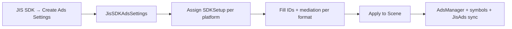

# Ads Editor Setup — JIS SDK v4

> Thiết kế lại luồng cấu hình ads trong Editor: **một nguồn sự thật**, platform rõ ràng, format bật/tắt qua mediation.

---

## Vấn đề trước đây

| Vấn đề | Mô tả |
|--------|--------|
| **Trùng cấu hình** | `AdsManagerSDKSetupContainer` (android/ios) **và** `JisSDKAdsSettings` (profiles) cùng tồn tại |
| **Đường dẫn rải rác** | `Assets/JisSDKConfigs/` vs `Assets/JisSDKAds/Settings/` |
| **Menu cũ** | `SDK Setup/...` vs `JIS SDK/...` |
| **Bug apply** | Interstitial `AdsConfig` dùng nhầm mediation của **Banner** |
| **isActive sai** | Mọi format luôn `isActive = true` dù mediation = NONE |
| **Auto apply** | Chỉ tìm Container, bỏ qua `JisSDKAdsSettings` |

---

## Thiết kế mới (v4)

### Single source of truth: `JisSDKAdsSettings`

```
JisSDKAdsSettings.asset
├── android: PlatformAdsProfile
│   ├── mediation (MAX | ADMOB)
│   ├── sdkSetup → AndroidSDKSetup.asset
│   ├── maxProviderConfig / admobProviderConfig (Core, optional)
│   └── tieredAdsConfig (optional)
├── ios: PlatformAdsProfile
│   └── (tương tự)
├── adsInitializationMode
└── singleMediationOnly
```

### Bật/tắt ad format

Trong từng `SDKSetup`, mỗi format có field `xxxAdsMediationType`:

| Giá trị | Ý nghĩa |
|---------|---------|
| `NONE` | Format **tắt** — không init, không load |
| `MAX` | Format dùng AppLovin MAX |
| `ADMOB` | Format dùng Google AdMob |

Inspector `JisSDKAdsSettings` hiển thị **overview** từng platform (✓ / —) theo `AdsSetupUtility`.

### Platform

- **Editor preview:** toolbar Android | iOS trên `JisSDKAdsSettings` inspector
- **Apply to Scene:** áp profile theo **active build target** hiện tại
- **Runtime:** `GetActiveProfile()` theo `Application.platform`

---

## Luồng Editor



### Menu chính (`JIS SDK`)

```
JIS SDK/
├── Hub
├── Ads/
│   ├── Create Settings Asset
│   ├── Apply Settings to Scene
│   ├── Create Reward Placements Config
│   ├── Create Tiered Ads Config
│   ├── Scene/
│   │   └── Add Manager Prefab
│   ├── Auto Apply/ ...
│   └── Legacy/ ...
├── IAP/                              ← tách riêng khỏi Ads
│   ├── Create Packages Config
│   └── Scene/
│       └── Add InApp Purchaser Prefab
└── (Hub import IAP module trước — menu IAP cần UNITY_IAP_ACTIVE)

GameObject/JIS SDK/
├── Ads/
│   └── Add Manager
└── IAP/
    └── Add InApp Purchaser
```

> Menu cũ `SDK Setup/...` đã gỡ — dùng cây menu trên.

### Inspector `JisSDKAdsSettings`

- **Apply to Scene** — gán cả 2 platform SDKSetup vào AdsManager, apply active target, `SetupSymbol()`
- **Validate** — thiếu SDKSetup, không format nào active, tiered thiếu ID
- **Platform toolbar** — xem overview + inline SDKSetup / TieredAdsConfig

---

## Legacy: `AdsManagerSDKSetupContainer`

Vẫn hỗ trợ backward compatibility:

- Menu: `JIS SDK/Legacy/Ads Setup Container`
- Field **`unifiedSettings`**: khi gán → Apply dùng `JisSDKAdsSettings`
- Field `android` / `ios` trực tiếp: chỉ khi **không** có unified settings

Khuyến nghị: gán `unifiedSettings` hoặc migrate sang chỉ dùng `JisSDKAdsSettings`.

---

## Apply pipeline (`JisSDKAdsSettingsApplier`)

1. `settings.ApplyToAdsManager(adsManager)` — gán android/ios setup + `UpdateAdsMediationConfig`
2. Sync `JisAds.settings` trong scene
3. `SDKSetup.SetupSymbol()` — scripting defines MAX/ADMOB

---

## Bug fixes (runtime)

1. **Interstitial AdsConfig** — dùng `GetAdsMediationType(INTERSTITIAL)` (trước đó nhầm BANNER)
2. **isActive** — `IsActiveAdsType(type)` → mediation != NONE

---

## Checklist setup game mới

1. `JIS SDK → Create Ads Settings Asset`
2. Chọn `JisSDKAdsSettings` → tab Android / iOS
3. Mỗi platform: chọn **primary mediation**
4. Trong SDKSetup: set mediation từng format + ad unit IDs
5. (Optional) Gán `TieredAdsConfig` trên profile
6. Scene: **JIS SDK → Ads → Scene → Add Manager Prefab** (tự build `JisSDK_Manager` + lưu prefab vào `Assets/JisSDKAds/Prefabs/` lần đầu)
7. Gán `JisSDKAdsSettings` trên `JisAds` nếu chưa auto-link
8. **Apply to Scene**
8. Play / Build — auto apply nếu bật

---

## File tham chiếu

| File | Vai trò |
|------|---------|
| `Settings/JisSDKAdsSettings.cs` | Root config asset |
| `Settings/PlatformAdsProfile.cs` | Per-platform profile |
| `Settings/AdsSetupUtility.cs` | Format active status |
| `Editor/Settings/JisSDKAdsSettingsEditor.cs` | Unified inspector |
| `Editor/Settings/JisSDKAdsSettingsApplier.cs` | Apply + validate |
| `Configs/AdsManagerSDKSetupContainer.cs` | Legacy wrapper |
