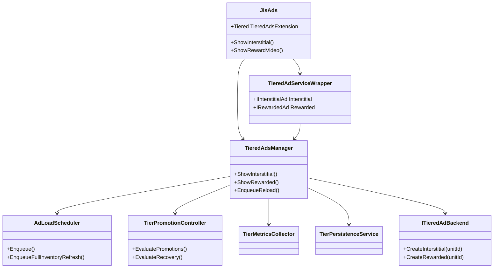
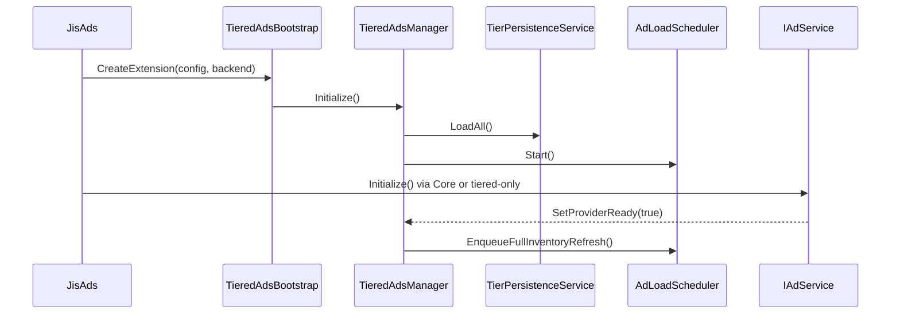
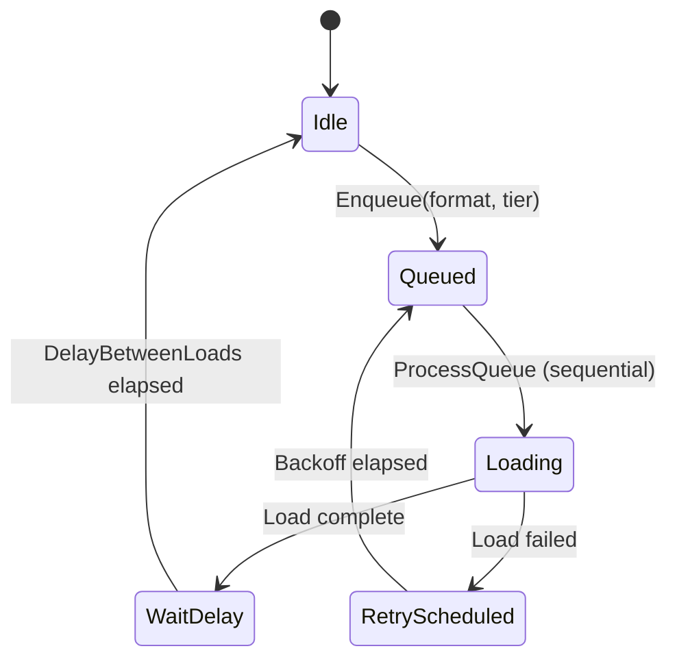
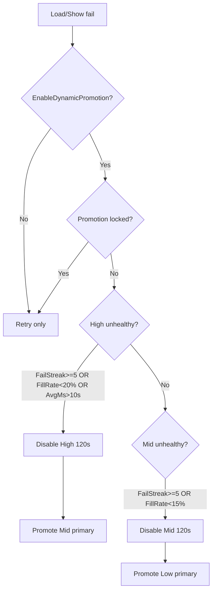

# Tiered Ad Inventory — JIS SDK Ads v4

Optional extension layer for **High / Mid / Low** tier inventory on **Interstitial** and **Rewarded**.  
Fully backward compatible — default `EnableTieredInventory = false` keeps existing SDK behavior.

---

## System Modes

### Mode A — Single Unit (default)

```
EnableTieredInventory = false
```

- One interstitial unit ID, one rewarded unit ID
- Uses existing `AutoLoadSystem` (legacy) or Core `AdManager` load-on-show
- No scheduler, tier cache, promotion, or extra inventory
- **Identical to pre-tiered SDK**

### Mode B — Tiered Inventory

```
EnableTieredInventory = true
```

- Interstitial: High + Mid + Low (max 3 loaded)
- Rewarded: High + Mid + Low (max 3 loaded)
- Sequential load scheduler (no burst loading)
- Tier fallback on show
- Dynamic promotion + recovery (optional)
- Local persistence across restarts

---

## Architecture



**Not modified:** `AdsManager`, mediation controllers, App Open, MREC, Resume, Rewarded Interstitial.

---

## Feature Flags

| Field | Default | Description |
|-------|---------|-------------|
| `EnableTieredInventory` | `false` | Master switch |
| `EnableTieredInventoryForInterstitial` | `true` | Per-format tiered interstitial |
| `EnableTieredInventoryForRewarded` | `true` | Per-format tiered rewarded |
| `EnableDynamicPromotion` | `true` | Auto promote/downgrade tiers |
| `PreferLastSuccessfulTier` | `true` | Prefer last successful tier on show |

If per-format flag is `false`, that format uses the inner provider single unit (legacy behavior for that format).

---

## Configuration

### Create asset

**JIS SDK → Tiered Ads Config** → `TieredAdsConfig.asset`

Assign on `PlatformAdsProfile.tieredAdsConfig` in `JisSDKAdsSettings`.

### Sample config

```yaml
EnableTieredInventory: true
EnableTieredInventoryForInterstitial: true
EnableTieredInventoryForRewarded: true
EnableDynamicPromotion: true
PreferLastSuccessfulTier: true
DelayBetweenLoads: 0.75
MaxParallelLoads: 1
TierDisableDuration: 120
PromotionLockDuration: 60
RollingWindowSize: 20

Interstitial:
  High: "ca-app-pub-xxx/inter-high"
  Mid:  "ca-app-pub-xxx/inter-mid"
  Low:  "ca-app-pub-xxx/inter-low"

Rewarded:
  High: "ca-app-pub-xxx/reward-high"
  Mid:  "ca-app-pub-xxx/reward-mid"
  Low:  "ca-app-pub-xxx/reward-low"

LegacyInterstitial:
  UnitId: "ca-app-pub-xxx/inter-single"
LegacyRewarded:
  UnitId: "ca-app-pub-xxx/reward-single"
```

If tier IDs are empty, `TieredAdsConfigFactory` fills from `SDKSetup` (AdMob: first 3 list entries; MAX: primary ID + suffix placeholders).

---

## Initialization Flow



### Sample initialization (game code)

```csharp
using JisSDKAds.Ads;
using JisSDKAds.Core.Tiered;

// Automatic when TieredAdsConfig assigned and EnableTieredInventory=true
await JisAds.Instance.InitializeAsync(fetchRemoteConfig: true);

// Optional: subscribe analytics
TieredAdEvents.OnAnalyticsEvent += evt =>
{
    Debug.Log($"Tier event: {evt.EventName} {evt.AdsType} {evt.PreviousTier}->{evt.NewTier}");
};
```

---

## Load Scheduler Flow



**Queue order (full refresh):**

1. Interstitial High  
2. Rewarded High  
3. Interstitial Mid  
4. Rewarded Mid  
5. Interstitial Low  
6. Rewarded Low  

**Rules:** `MaxParallelLoads = 1`, skip disabled tiers, skip duplicate pending loads, no instant reload after close.

---

## Show Logic

**Priority order:**

1. `CurrentPrimaryTier`
2. `LastSuccessfulTier` (if `PreferLastSuccessfulTier`)
3. Higher available tier (High → Mid → Low)
4. Lower available tier (Low → Mid → High)

On success: update `LastSuccessfulTier`, metrics, enqueue scheduler reload.

---

## Promotion Flow



**Hysteresis:** no tier change while `PromotionLockUntil` active (default 60s).

**Recovery:** after disable duration, retry tier; **3 successful loads** restore priority.

State is **separate** for Interstitial and Rewarded.

---

## Persistence Flow

Saved to `PlayerPrefs` on pause and after tier state changes:

- `CurrentPrimaryTier`, `LastSuccessfulTier`
- `TemporaryDisabledUntil`, `PromotionLockUntil`
- `FailCount`, `SuccessCount`, `FillRate` per tier

Restored on cold boot and foreground resume — prevents jumping back to unhealthy High tier.

---

## Retry Backoff

Per-tier delay (seconds), capped at 30:

| Tier | Sequence |
|------|----------|
| High | 2, 4, 8, 16 |
| Mid | 4, 8, 16 |
| Low | 8, 16, 30 |

Reset retry count on successful load. Disabled tiers skip retry until cooldown ends.

---

## Analytics Events

| Event | When |
|-------|------|
| `tier_load_success` | Tier load OK |
| `tier_load_fail` | Tier load failed |
| `tier_show_success` | Show OK |
| `tier_show_fail` | Show failed |
| `tier_promoted` | Primary tier lowered |
| `tier_disabled` | Tier temporarily disabled |
| `tier_restored` | Primary restored to High |
| `tier_recovered` | Disabled tier passed recovery threshold |

Subscribe via `TieredAdEvents.OnAnalyticsEvent` and forward to Firebase as needed.

**Payload fields:** `AdsType`, `PreviousTier`, `NewTier`, `FailCount`, `SuccessCount`, `FillRate`, `AverageResponseTime`, `LoadLatency`, `PromotionReason`, `RecoveryReason`.

---

## Sample Show Code

```csharp
using JisSDKAds.Ads;

// Interstitial (tiered when enabled)
JisAds.Instance.ShowInterstitial(
    closedCallback: () => Debug.Log("Interstitial closed"),
    showFailCallback: () => Debug.Log("Interstitial failed"));

// Rewarded
JisAds.Instance.ShowRewardVideo(
    rewardedPlacement: "double_coin",
    successCallback: () => Debug.Log("Reward granted"),
    failedCallback: () => Debug.Log("Reward failed"));

// Inventory status
bool ready = JisAds.Instance.IsInterstitialAdLoaded();
var tiered = JisAds.Instance.Tiered;
if (tiered != null)
{
    var inv = tiered.Manager.GetInventory(JisSDKAds.Core.Tiered.Models.AdsFormatType.Interstitial);
    Debug.Log($"Primary tier: {inv.CurrentPrimaryTier}");
}
```

---

## Migration Notes

1. Create `TieredAdsConfig` asset (leave `EnableTieredInventory = false` initially).
2. Assign to `PlatformAdsProfile.tieredAdsConfig`.
3. Fill High/Mid/Low unit IDs (or rely on AdMob list auto-fill).
4. Enable `useCoreForStandardFormats` on `JisAds` (**recommended** for tiered mode).
5. Set `EnableTieredInventory = true` when ready to test.
6. Subscribe to `TieredAdEvents` for Firebase bridging.

---

## Backward Compatibility

| Scenario | Behavior |
|----------|----------|
| No `TieredAdsConfig` assigned | Unchanged SDK |
| `EnableTieredInventory = false` | Unchanged SDK |
| Per-format flag off | That format uses single unit via Core/Legacy |
| Legacy `AdsManager` | Not modified; still required for App Open, MREC, RC |
| Existing `JisAds` API | Same method signatures |

---

## File Reference

| Component | Path |
|-----------|------|
| Config | `Packages/com.jis.sdkads.core/Runtime/Tiered/Config/TieredAdsConfig.cs` |
| Manager | `Packages/com.jis.sdkads.core/Runtime/Tiered/Services/TieredAdsManager.cs` |
| Scheduler | `Packages/com.jis.sdkads.core/Runtime/Tiered/Services/AdLoadScheduler.cs` |
| Promotion | `Packages/com.jis.sdkads.core/Runtime/Tiered/Services/TierPromotionController.cs` |
| Wrapper | `Packages/com.jis.sdkads.core/Runtime/Tiered/Ads/TieredAdServiceWrapper.cs` |
| Bootstrap | `Packages/com.jis.sdkads.core/Runtime/Tiered/TieredAdsBootstrap.cs` |
| JisAds integration | `Packages/com.jis.sdkads.ads/Runtime/JisAds.cs` |
| MAX backend | `Packages/com.jis.sdkads.providers.max/Runtime/MaxTieredAdBackend.cs` |
| AdMob backend | `Packages/com.jis.sdkads.providers.admob/Runtime/AdMobTieredAdBackend.cs` |

---

## Logging

Enable verbose logs:

```csharp
JisSDKAds.Core.Tiered.Logging.TieredAdsLogger.Verbose = true;
```

Default tag: `[TieredAds]`.
